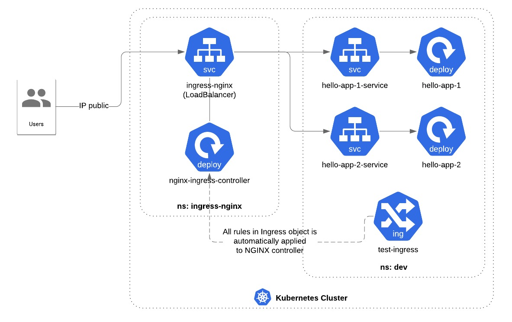

# Hello k8s NGINX Ingress

This is a simple application demonstrating how to deploy NGINX Ingress in Google Kubernetes Engine

## Overview



## Setup LoadBalancer and NGINX Controller

### Create mandatory objects

```bash
kubectl apply -f mandatory.yaml
```

The command above is similiar to

```bash
kubectl apply -f https://raw.githubusercontent.com/kubernetes/ingress-nginx/master/deploy/static/mandatory.yaml
```

Check the ingress controller pods to make sure if it is setup correctly.

```bash
kubectl get pods -n ingress-nginx
```

### Create LoadBalancer

```bash
kubectl apply -f nginx-ingress.yaml
```

Check the created service

```bash
kubectl get svc -n ingress-nginx
```

## Setup Application

### Create a namespace named `dev`

```bash
kubectl create namespace dev
```

### Create deployment and service

Service 1

```bash
kubectl apply -f hello-app-1.yaml -f hello-app-1-service.yaml
```

Service 2

```bash
kubectl apply -f hello-app-2.yaml -f hello-app-2-service.yaml
```

Check the service status

```bash
kubectl get svc -n dev
```

### Create Ingress Object

```bash
kubectl apply -f ingress.yaml
```

Check the configuration of newly created ingress object

```bash
kubectl describe ingress -n dev
```
